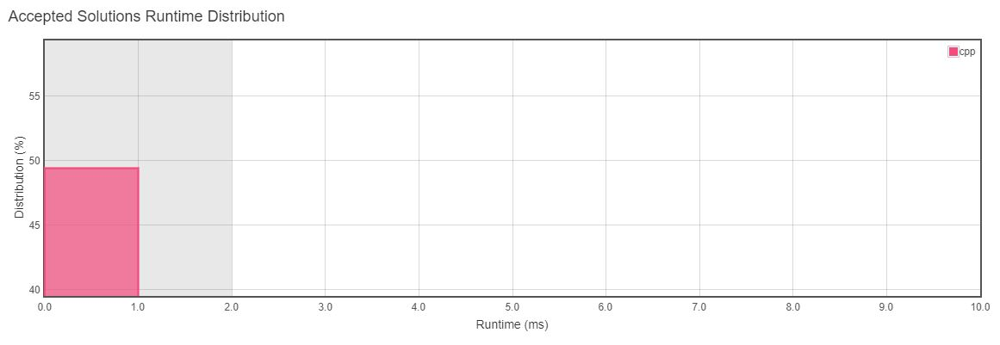
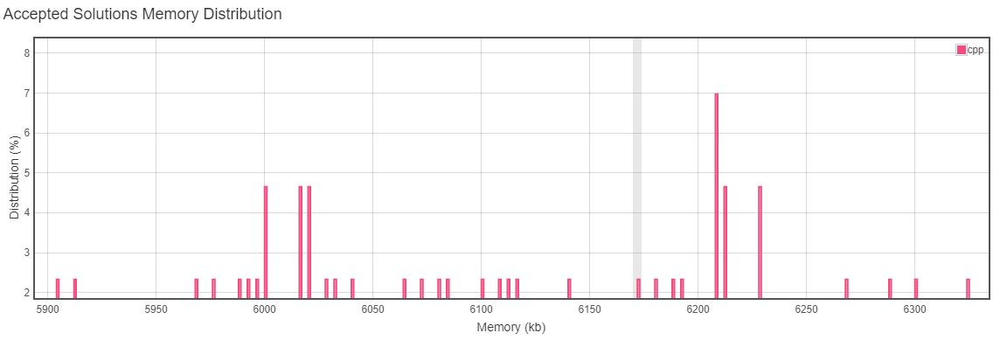

<h3>Problem Statement</h3>

<h2>Detect Capital</h2>
Given a word, you need to judge whether the usage of capitals in it is right or not.

We define the usage of capitals in a word to be right when one of the following cases holds:

- All letters in this word are capitals, like "USA".
- All letters in this word are not capitals, like "leetcode".
- Only the first letter in this word is capital, like "Google".
- Otherwise, we define that this word doesn't use capitals in a right way.

__Example 1:__ 
Input: "USA" 
Output: True 
 

__Example 2:__ 
Input: "FlaG" 
Output: False 

__*Note: The input will be a non-empty word consisting of uppercase and lowercase latin letters.*__

<h3>__Runtime Distribution__</h3> 

<h3>__Memory Distribution__</h3> 

