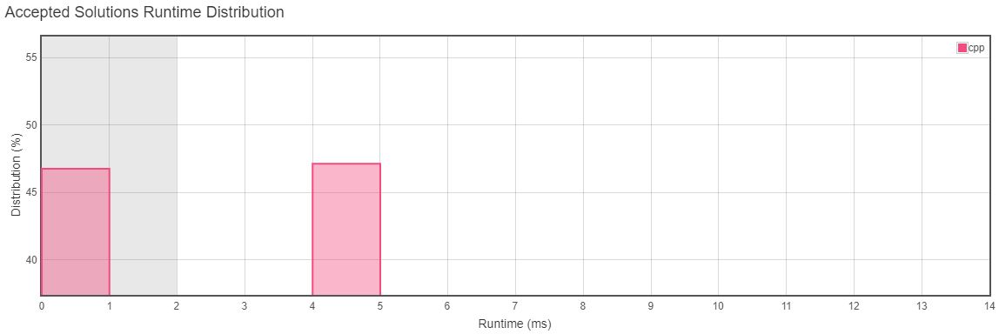

<h3>Problem Statement</h3>

<h2>Excel Sheet Column Number</h2>

Given a column title as appear in an Excel sheet, return its corresponding column number. 

**For example:**  

    A -> 1
    B -> 2
    C -> 3
    ...
    Z -> 26
    AA -> 27
    AB -> 28 
    ...
**Example 1:**  
*Input:* "A"  
*Output:* 1  

**Example 2:**  
*Input:* "AB" 
*Output:* 28 

**Example 3:**  
*Input:* "ZY" 
*Output:* 701 
 

**Constraints:**  

 - 1 <= s.length <= 7
 - s consists only of uppercase English letters.
 - s is between "A" and "FXSHRXW".

__Runtime Distribution__ 

__Memory Distribution__ 

