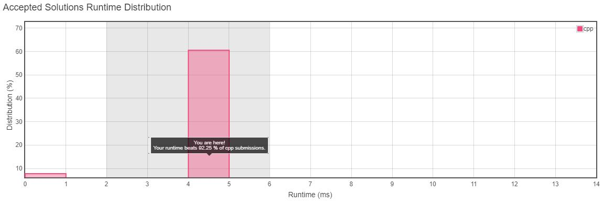

<h3>Problem Statement</h3>

<h2>H-Index</h2>

Given an array of citations (each citation is a non-negative integer) of a researcher, write a function to compute the researcher's h-index. 

According to the definition of h-index on Wikipedia: "A scientist has index h if h of his/her N papers have at least h citations each, and the other N − h papers have no more than h citations each."
  
**Example:**  

**Input:** citations = [3,0,6,1,5] 
**Output:** 3  
*Explanation:* [3,0,6,1,5] means the researcher has 5 papers in total and each of them had received 3, 0, 6, 1, 5 citations respectively. 
             Since the researcher has 3 papers with at least 3 citations each and the remaining 
             two with no more than 3 citations each, her h-index is 3. 
             
*Note: If there are several possible values for h, the maximum one is taken as the h-index.*  

__Runtime Distribution__ 

__Memory Distribution__ 

