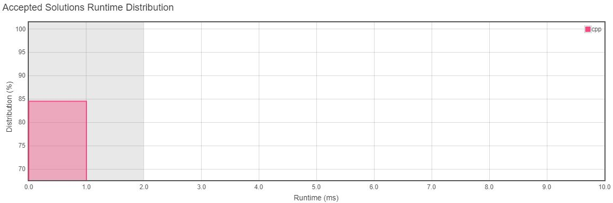
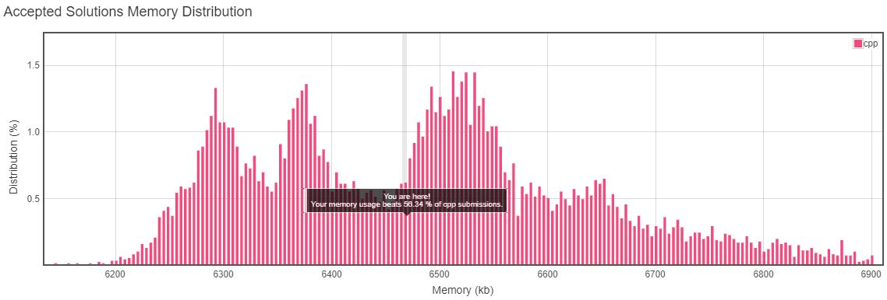

<h3>Problem Statement</h3>

<h2>Pascal's Triangle II</h2>
Given a non-negative index k where k ≤ 33, return the kth index row of the Pascal's triangle. 
Note that the row index starts from 0. 
In Pascal's triangle, each number is the sum of the two numbers directly above it. 
 

**Example:** 
**Input:** 3 
**Output:** [1,3,3,1] 

*Follow up:Could you optimize your algorithm to use only O(k) extra space?*  

__Runtime Distribution__ 

__Memory Distribution__ 

