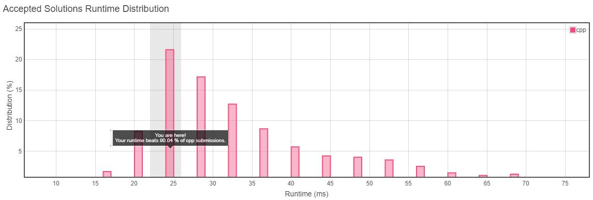

<h3>Problem Statement</h3>

<h2>Iterator for Combination</h2>

Design an Iterator class, which has: 

- A constructor that takes a string characters of sorted distinct lowercase English letters and a number combinationLength as arguments.
- A function next() that returns the next combination of length combinationLength in lexicographical order.
- A function hasNext() that returns True if and only if there exists a next combination.
 

**Example:**  

>CombinationIterator iterator = new CombinationIterator("abc", 2); // creates the iterator. 
>iterator.next(); // returns "ab" 
>iterator.hasNext(); // returns true 
>iterator.next(); // returns "ac" 
>iterator.hasNext(); // returns true 
>iterator.next(); // returns "bc" 
>iterator.hasNext(); // returns false 
 

**Constraints:**

- 1 <= combinationLength <= characters.length <= 15
- There will be at most 10^4 function calls per test.
- It's guaranteed that all calls of the function next are valid.

__Runtime Distribution__ 

__Memory Distribution__ 

