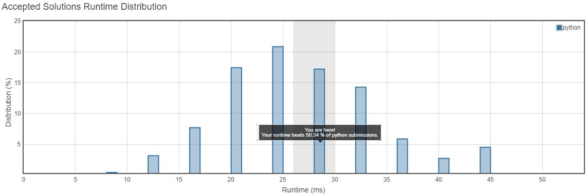
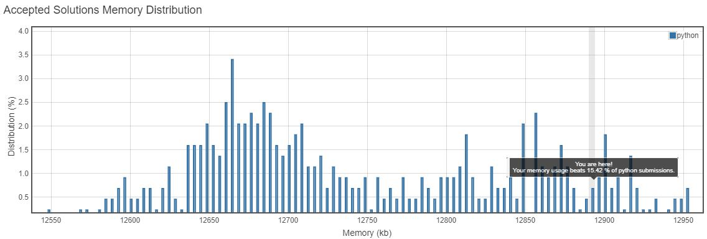

<h3>Problem Statement</h3>

<h2>Longest Palindrome</h2>

Given a string which consists of lowercase or uppercase letters, find the length of the longest palindromes that can be built with those letters. 
This is case sensitive, for example "Aa" is not considered a palindrome here. 

**Note:**  
Assume the length of given string will not exceed 1,010. 

>**Example:**  
>Input:"abccccdd" 
>Output:7 
>*Explanation: One longest palindrome that can be built is "dccaccd", whose length is 7.*  

__Runtime Distribution__ 

__Memory Distribution__ 

__Runtime Distribution__ 

__Memory Distribution__ 

