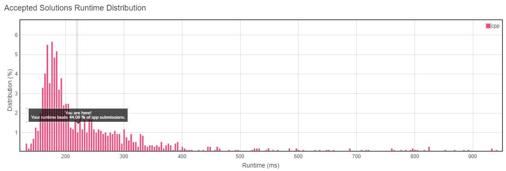

<h3>Problem Statement</h3>

<h2>Design HashSet</h2>
Design a HashSet without using any built-in hash table libraries. 
To be specific, your design should include these functions:

- **add(value):** Insert a value into the HashSet.
- **contains(value):** Return whether the value exists in the HashSet or not.
- **remove(value):** Remove a value in the HashSet. If the value does not exist in the HashSet, do nothing.

**Example: **

> MyHashSet hashSet = new MyHashSet();
> hashSet.add(1);         
> hashSet.add(2);         
> hashSet.contains(1);    // returns true
> hashSet.contains(3);    // returns false (not found)
> hashSet.add(2);          
> hashSet.contains(2);    // returns true
> hashSet.remove(2);          
> hashSet.contains(2);    // returns false (already removed)

__Note:__

* All values will be in the range of [0, 1000000].
* The number of operations will be in the range of [1, 10000].
* Please do not use the built-in HashSet library.

__Runtime Distribution__ 

__Memory Distribution__ 

