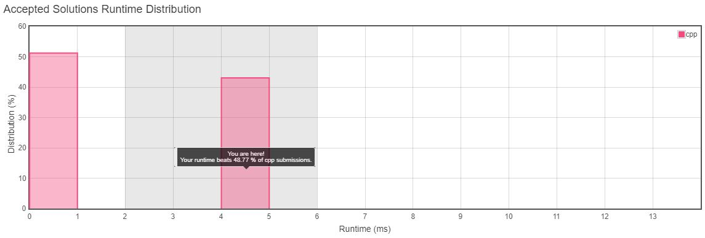
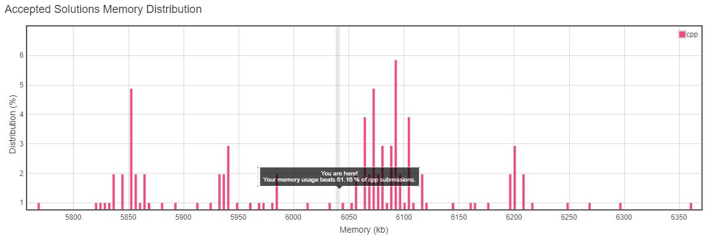
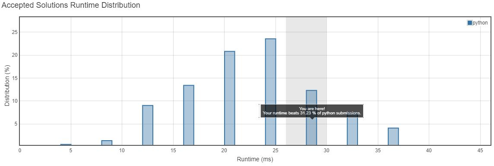
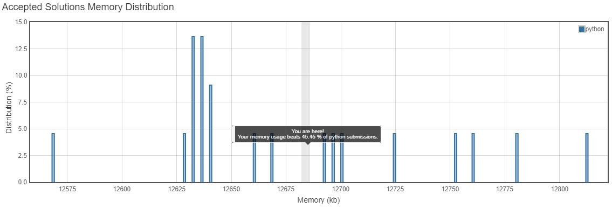

<h3>Problem Statement</h3>

<h2>Power of Four</h2>
Given an integer (signed 32 bits), write a function to check whether it is a power of 4.  

**Example 1:**  
Input: 16 
Output: true 

**Example 2:**  
Input: 5 
Output: false  
*Follow up: Could you solve it without loops/recursion?*

__Runtime Distribution__ 

__Memory Distribution__ 

__Runtime Distribution__ 

__Memory Distribution__ 

