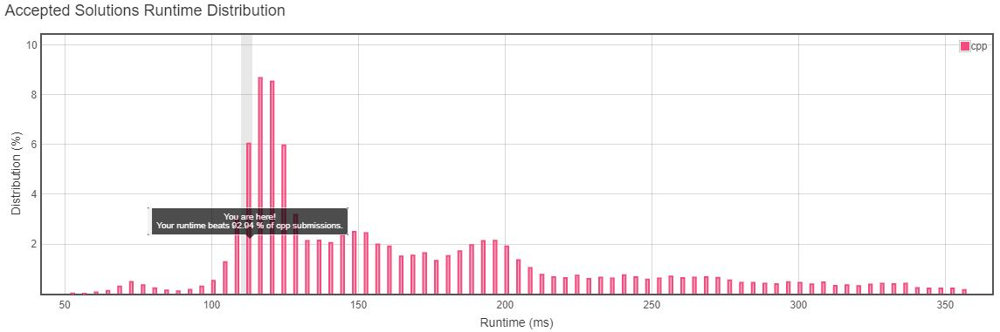
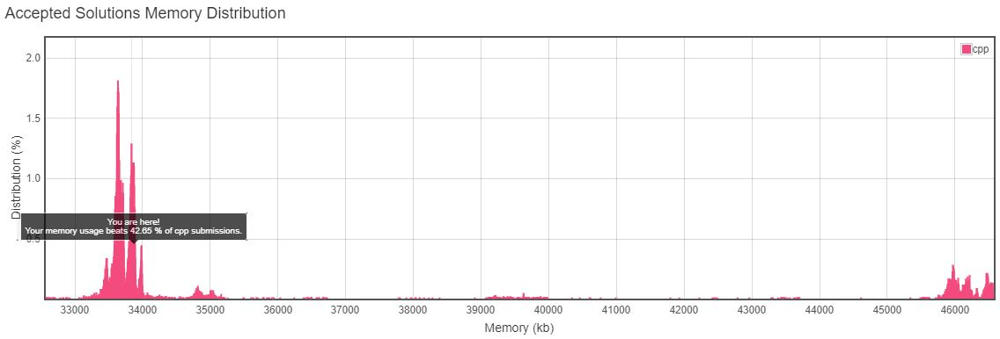
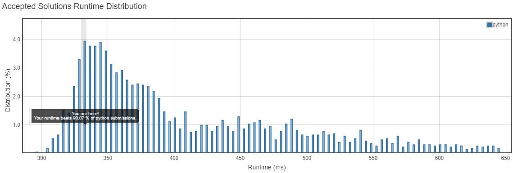
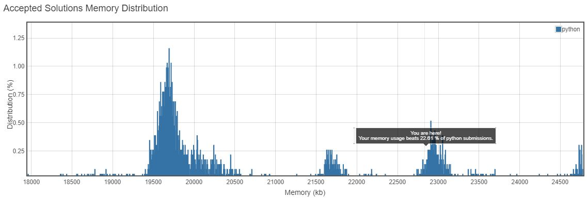

<h3>Problem Statement</h3>

<h2>Find All Duplicates in an Array</h2>
Given an array of integers, 1 ≤ a[i] ≤ n (n = size of array), some elements appear twice and others appear once. 
Find all the elements that appear twice in this array. 

*Could you do it without extra space and in O(n) runtime?*

 

**Example:**  
**Input:**
[4,3,2,7,8,2,3,1]
 
**Output:** 
[2,3] 
 
__Runtime Distribution__ 

__Memory Distribution__ 

__Runtime Distribution__ 

__Memory Distribution__ 

