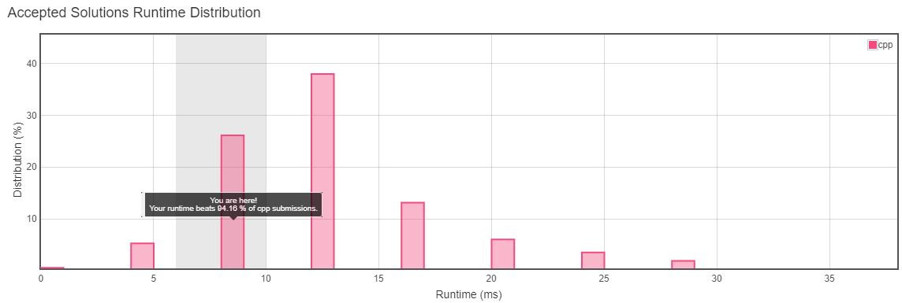
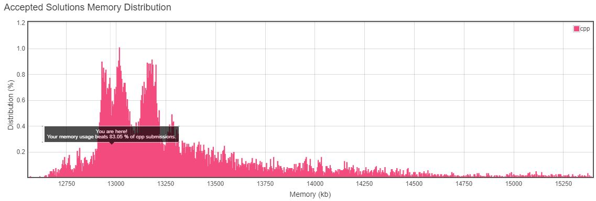

<h3>Problem Statement</h3>

<h2>Rotting Oranges</h2>
In a given grid, each cell can have one of three values: 

- the value 0 representing an empty cell;
- the value 1 representing a fresh orange;
- the value 2 representing a rotten orange.
Every minute, any fresh orange that is adjacent (4-directionally) to a rotten orange becomes rotten. 

Return the minimum number of minutes that must elapse until no cell has a fresh orange.  If this is impossible, return -1 instead. 

**Example 1:**  
*Input:* [[2,1,1],[1,1,0],[0,1,1]] 
*Output:* 4 

**Example 2:**  
*Input:* [[2,1,1],[0,1,1],[1,0,1]] 
*Output:* -1 
**Explanation:**  The orange in the bottom left corner (row 2, column 0) is never rotten, because rotting only happens 4-directionally.  

**Example 3:**  
*Input:* [[0,2]] 
*Output:* 0 
**Explanation:**  Since there are already no fresh oranges at minute 0, the answer is just 0. 
 

**Note:**  
- 1 <= grid.length <= 10
- 1 <= grid[0].length <= 10
- grid[i][j] is only 0, 1, or 2.

__Runtime Distribution__ 

__Memory Distribution__ 

